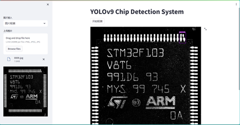

# yolov9-streamlit

Deploy [YOLOv9](https://github.com/ultralytics/yolov5/releases/tag/v5.0) detection with [Streamlit](https://github.com/streamlit/streamlit)


# 线上体验

直接访问 <https://yolov9-4m2a2davieacj67krvy3gv.streamlit.app/>

# 安装依赖

```
# 本地安装的话，请将opencv-python-headless改为opencv-python
pip install -r requirements.txt
```

如果有`GPU`的话，将`torch`替换成`gpu`版本可加速检测

# 运行项目

```
streamlit run main.py
```

**图片检测**



